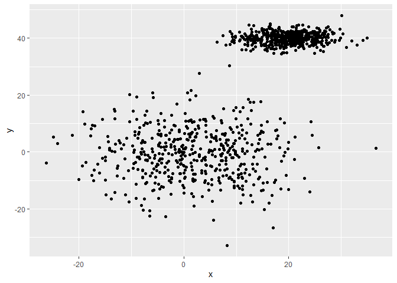

<!-- README.md is generated from README.Rmd. Please edit that file -->

# clust431

<!-- badges: start -->

<!-- badges: end -->

The goal of clust431 is to implement EM clustering on a dataset

## Installation

You can install the released version of clust431 from
[CRAN](https://CRAN.R-project.org) with:

You access the github repository through this link:
<https://github.com/Cal-Poly-Advanced-R/lab-8-expectation-maximization-shanealman>

``` r
install.packages("clust431")
```

## EM Clustering Code

``` r
em_clust = function(x, k){
    priors = rep(1/k, k)
    x = as.matrix(x)
    if(ncol(x) > 1){
        x = data.frame(x)
        means = sample_n(x, k)
    }else {
        means = sample(x, k)}
    x = as.matrix(x)
    cov.var = vector('list', length = k)
    for(i in 1:k){
        if(
            ncol(x) > 1){cov.var[[i]] = cov(x)
        }else {
            cov.var[[i]] = sd(x)}
    }
    probs2 = 0
    probs1 = 1
    while(sum((probs2 - probs1)^2) > 0.00001){
        probs1 = probs2
        probs2 = NULL
        if(ncol(x) > 1){
            for(i in 1:k){
                initprob = dmvnorm(x, as.numeric(means[i,]), cov.var[[i]])
                probs2 = cbind(probs2, initprob)}
        } else {
            for(i in 1:k){
                initprob = dnorm(x, means[i], cov.var[[i]])
                probs2 = cbind(probs2, initprob)
            }
        }
        totalpost = 0
        for(i in 1:k){
            tempP = priors[i]*probs2[,i]
            totalpost = totalpost + tempP}
        posts = NULL
        for(i in 1:k){
            initpost = (priors[i]*probs2[,i])/totalpost
            posts = cbind(posts, initpost)}
        priors = apply(posts, 2, mean)
        means = NULL
        if(ncol(x) > 1){
            for(i in 1:k){
                tempM = colSums(posts[,i]*x)/sum(posts[,i])
                means = rbind(means, tempM)}
        } else {
            for(i in 1:k){
                tempM = sum(posts[,i]*x)/sum(posts[,i])
                means = c(means, tempM)
            }
        }
        lambda = NULL
        for(i in 1:k){
            templambda = posts[,i]/(length(posts[,i])*priors[i])
            lambda = cbind(lambda, templambda)}
        cov.var = vector('list', length = k)
        if(ncol(x) > 1){
            for(i in 1:k){
                tempcov.var = 0
                for(l in 1:nrow(posts)){
                    initcov.var = lambda[l,i] * ((x[l,] - means[i,]) %*% t(x[l,] - means[i,]))
                    tempcov.var = tempcov.var + initcov.var}
                cov.var[[i]] = tempcov.var}
        } else {
            cov.var = vector('list', length = k)
            for(i in 1:k){
                tempcov.var = 0
                for(l in 1:nrow(posts)){
                    initcov.var = lambda[l,i] * ((x[l,] - means[i]) %*% t(x[l,] - means[i]))
                    tempcov.var =tempcov.var + initcov.var}
                cov.var[[i]] = sqrt(tempcov.var)
            }
        }
    }
    clust = rep(NA, nrow(posts))
    for(i in 1:nrow(posts)){clust[i] = which(posts[i,] == max(posts[i,]), arr.ind = T)}
    rownames(means) = NULL
    return(list('Clusters' = clust, 'Means' = means, 'Covariance' = cov.var))
}
```

## Example EM Clustering

### **Comparison of EM versus K-means clustering**

``` r
dataframe = select(iris, Sepal.Length, Sepal.Width)

em_clust(dataframe, 3)
#> $Clusters
#>   [1] 1 1 1 1 1 1 1 1 1 1 1 1 1 1 1 1 1 1 1 1 1 1 1 1 1 1 1 1 1 1 1 1 1 1 1 1 1
#>  [38] 1 1 1 1 3 1 1 1 1 1 1 1 1 3 3 2 3 2 3 2 3 2 3 3 2 2 3 2 3 2 3 2 3 2 3 2 3
#>  [75] 3 3 2 2 3 3 3 3 3 3 2 2 3 2 2 3 3 3 3 3 3 2 3 3 3 3 2 3 2 3 3 2 3 2 2 3 3
#> [112] 2 2 3 3 3 3 3 2 2 3 3 2 2 3 2 3 3 2 2 2 3 2 2 2 2 2 3 3 2 3 2 3 3 3 2 2 3
#> [149] 2 2
#> 
#> $Means
#>      Sepal.Length Sepal.Width
#> [1,]     5.015846    3.454843
#> [2,]     6.348828    2.861664
#> [3,]     6.104125    2.878089
#> 
#> $Covariance
#> $Covariance[[1]]
#>      Sepal.Length Sepal.Width
#> [1,]   0.11951622  0.08830995
#> [2,]   0.08830995  0.11816069
#> 
#> $Covariance[[2]]
#>      Sepal.Length Sepal.Width
#> [1,]   0.43124165  0.04653261
#> [2,]   0.04653261  0.09658910
#> 
#> $Covariance[[3]]
#>      Sepal.Length Sepal.Width
#> [1,]    0.4817761   0.2175826
#> [2,]    0.2175826   0.1294874

kmeans(dataframe, 3)
#> K-means clustering with 3 clusters of sizes 50, 47, 53
#> 
#> Cluster means:
#>   Sepal.Length Sepal.Width
#> 1     5.006000    3.428000
#> 2     6.812766    3.074468
#> 3     5.773585    2.692453
#> 
#> Clustering vector:
#>   [1] 1 1 1 1 1 1 1 1 1 1 1 1 1 1 1 1 1 1 1 1 1 1 1 1 1 1 1 1 1 1 1 1 1 1 1 1 1
#>  [38] 1 1 1 1 1 1 1 1 1 1 1 1 1 2 2 2 3 2 3 2 3 2 3 3 3 3 3 3 2 3 3 3 3 3 3 3 3
#>  [75] 2 2 2 2 3 3 3 3 3 3 3 3 2 3 3 3 3 3 3 3 3 3 3 3 3 3 2 3 2 2 2 2 3 2 2 2 2
#> [112] 2 2 3 3 2 2 2 2 3 2 3 2 3 2 2 3 3 2 2 2 2 2 3 3 2 2 2 3 2 2 2 3 2 2 2 3 2
#> [149] 2 3
#> 
#> Within cluster sum of squares by cluster:
#> [1] 13.1290 12.6217 11.3000
#>  (between_SS / total_SS =  71.6 %)
#> 
#> Available components:
#> 
#> [1] "cluster"      "centers"      "totss"        "withinss"     "tot.withinss"
#> [6] "betweenss"    "size"         "iter"         "ifault"
```

*These results show that both EM and K-means are producing similar
clustering means and clustering vectors; but, EM is also able to provide
the covariance matrix for each cluster.*

### **Example of EM clustering in many dimensions**

``` r
mtcars.cluster = em_clust(mtcars, 4)

mtcars.cluster$Means
#>           mpg      cyl     disp       hp     drat       wt     qsec        vs
#> [1,] 14.39204 7.095110 375.6234 183.6303 3.199596 4.705824 18.43350 0.2739687
#> [2,] 20.85681 5.801572 179.1019 171.9346 3.743625 2.923052 16.74912 0.4185310
#> [3,] 20.08936 6.490404 247.1492 149.2858 3.495841 3.169219 17.91642 0.4247744
#> [4,] 22.82398 5.221439 143.5372 104.2935 3.959715 2.672492 18.04639 0.5704389
#>              am     gear     carb
#> [1,] 0.08029242 3.195798 3.362410
#> [2,] 0.69238470 4.620249 4.565296
#> [3,] 0.24994462 3.459948 2.301341
#> [4,] 0.77073113 3.907733 2.588916
mtcars.cluster$Clusters
#>  [1] 4 4 4 3 3 3 3 2 3 2 4 3 3 3 1 1 1 3 4 3 3 3 3 3 3 4 2 2 3 2 2 4
```

### **Example of EM clustering with a large dataset**

``` r
dataframe2 = data.frame(x = c(rnorm(500, 20, 5), rnorm(500,1, 10)), 
                        y = c(rnorm(500, 40, 2),rnorm(500, 0, 9)))

em_clust(dataframe2, 2)
#> $Clusters
#>    [1] 2 1 2 2 1 1 2 2 1 2 2 2 2 2 2 2 1 2 2 1 1 2 2 2 1 2 2 2 2 1 2 2 1 2 2 2 1
#>   [38] 2 1 1 1 2 1 1 2 2 2 2 2 2 1 2 1 2 1 1 1 2 1 2 1 2 1 2 1 1 2 2 2 2 1 2 2 1
#>   [75] 1 1 2 1 1 2 2 2 1 2 2 1 2 1 2 2 2 2 2 2 2 2 2 1 2 2 2 2 2 2 2 2 2 2 2 1 2
#>  [112] 2 2 2 1 2 1 2 2 1 2 1 2 2 2 2 1 1 2 2 1 2 1 2 2 1 2 1 2 2 2 2 2 1 2 1 2 2
#>  [149] 2 1 1 2 2 2 2 1 2 2 2 2 2 2 1 2 1 1 1 2 2 2 1 2 2 2 1 1 1 2 1 2 2 2 2 2 2
#>  [186] 1 1 2 2 2 2 2 2 1 2 2 2 2 1 1 2 1 2 1 2 2 2 2 1 2 1 2 2 2 2 2 2 2 2 1 1 2
#>  [223] 2 1 1 2 2 1 1 1 2 1 1 1 1 2 2 1 2 1 1 2 2 2 2 2 1 2 2 1 1 2 1 2 1 2 2 1 1
#>  [260] 2 1 1 1 1 1 2 1 1 2 2 2 1 2 1 2 1 1 1 1 2 2 2 1 2 1 2 2 2 2 2 1 2 1 2 2 2
#>  [297] 2 1 2 2 2 2 1 2 1 1 2 2 2 1 2 1 2 2 1 2 1 1 2 2 2 2 2 2 2 2 2 2 2 2 1 1 2
#>  [334] 1 2 2 1 2 1 2 1 2 1 2 2 2 1 2 2 2 2 2 2 2 2 1 1 2 1 1 1 2 1 2 2 1 1 2 1 2
#>  [371] 1 2 1 1 2 1 1 1 2 2 2 2 2 1 2 1 2 1 2 2 2 2 1 2 2 1 2 2 1 1 2 2 1 2 1 2 2
#>  [408] 2 1 2 1 2 1 2 2 1 2 2 1 2 2 1 1 1 2 2 2 1 1 2 2 2 1 2 1 1 2 2 2 2 2 1 1 2
#>  [445] 2 2 2 2 1 1 1 1 1 2 1 2 2 2 2 2 2 1 2 1 2 2 1 2 1 1 2 2 1 2 1 1 2 1 1 1 2
#>  [482] 2 1 1 1 2 2 2 2 2 1 1 2 1 1 2 2 1 2 2 1 1 2 2 2 1 1 1 1 2 2 2 1 2 2 2 1 1
#>  [519] 1 2 1 1 1 2 1 1 2 1 1 1 2 1 2 2 2 1 1 2 1 2 1 1 2 2 1 1 1 2 2 2 2 1 1 1 2
#>  [556] 1 2 2 2 1 2 2 1 2 1 2 2 2 2 2 1 2 2 2 2 1 1 2 2 1 1 2 2 1 1 2 2 1 2 2 1 2
#>  [593] 2 1 2 1 2 1 2 1 2 1 1 2 1 2 2 2 2 2 2 2 1 1 2 2 2 1 2 1 2 2 1 2 1 1 1 1 2
#>  [630] 1 2 1 2 1 1 2 1 2 2 2 2 2 2 1 2 2 2 2 1 1 2 1 1 1 1 2 2 1 1 1 2 1 1 2 1 1
#>  [667] 1 1 2 1 1 2 2 2 2 1 1 1 1 2 1 1 2 2 1 1 1 1 2 1 2 1 2 2 1 1 2 1 1 2 1 1 1
#>  [704] 2 2 1 2 2 2 1 2 2 2 1 2 1 1 1 1 2 2 1 1 2 2 1 1 2 1 1 2 1 2 2 2 1 2 2 1 1
#>  [741] 2 2 2 2 1 1 1 2 2 2 2 2 1 1 1 1 2 1 2 1 1 1 2 2 2 1 2 2 2 1 1 2 1 2 2 1 2
#>  [778] 2 1 2 2 2 2 2 1 1 1 1 2 2 2 2 2 2 1 1 1 2 1 1 1 2 2 2 2 1 1 1 1 1 1 2 2 1
#>  [815] 1 2 1 2 2 2 2 2 1 1 1 1 2 1 1 1 2 2 2 2 1 1 1 2 2 2 1 2 2 2 1 1 2 2 2 1 2
#>  [852] 2 1 2 1 1 2 1 2 1 2 1 1 2 2 2 1 1 2 2 1 2 1 1 1 2 2 2 2 1 1 1 2 2 2 2 2 2
#>  [889] 2 2 1 1 1 1 1 2 2 2 1 2 2 2 2 1 2 1 1 1 1 2 2 2 2 2 1 2 2 2 1 1 1 1 1 2 1
#>  [926] 1 1 1 2 2 1 2 1 2 1 2 2 1 2 2 1 2 1 1 1 2 2 1 1 1 2 2 2 1 1 2 1 2 1 2 2 1
#>  [963] 1 2 1 1 2 2 1 2 2 2 2 2 2 1 2 2 2 2 1 1 2 2 2 1 2 1 1 1 1 1 1 1 1 2 2 1 1
#> [1000] 1
#> 
#> $Means
#>              x        y
#> [1,]  7.731091 21.49185
#> [2,] 13.546480 18.05971
#> 
#> $Covariance
#> $Covariance[[1]]
#>             x        y
#> [1,] 186.4216 237.4606
#> [2,] 237.4606 398.4474
#> 
#> $Covariance[[2]]
#>             x        y
#> [1,]  81.0065 141.6765
#> [2,] 141.6765 497.4084
ggplot(dataframe2) + geom_point(aes(x, y))
```



### **Example of EM clustering in a single dimension**

``` r
em_clust(iris$Sepal.Length, 3)
#> $Clusters
#>   [1] 1 1 1 1 1 3 1 1 1 1 3 1 1 1 3 3 3 1 3 1 3 1 1 1 1 1 1 1 1 1 1 3 1 3 1 1 3
#>  [38] 1 1 1 1 1 1 1 1 1 1 1 3 1 2 2 2 3 2 3 2 1 2 1 1 3 3 3 3 2 3 3 3 3 3 3 2 3
#>  [75] 2 2 2 2 3 3 3 3 3 3 3 3 2 2 3 3 3 3 3 1 3 3 3 3 1 3 2 3 2 2 2 2 1 2 2 2 2
#> [112] 2 2 3 3 2 2 2 2 3 2 3 2 2 2 2 3 3 2 2 2 2 2 2 3 2 2 2 3 2 2 2 3 2 2 2 2 2
#> [149] 3 3
#> 
#> $Means
#> [1] 4.905582 6.505491 5.820827
#> 
#> $Covariance
#> $Covariance[[1]]
#>           [,1]
#> [1,] 0.2824209
#> 
#> $Covariance[[2]]
#>           [,1]
#> [1,] 0.6802093
#> 
#> $Covariance[[3]]
#>           [,1]
#> [1,] 0.5104316
plot(iris$Sepal.Length, pch = 20, ylab = '')
```


### **Speed check on a large dataset**

``` r
tic()
datacluster = em_clust(dataframe2, 5)
datacluster$Means
#>               x          y
#> [1,]  0.4251386 -0.6078654
#> [2,] 12.3235135 -2.4841743
#> [3,] 19.7969088 39.9733830
#> [4,]  3.4041948 16.3152573
#> [5,] 11.7132500 -1.4343187
toc()
#> 0.89 sec elapsed
```
